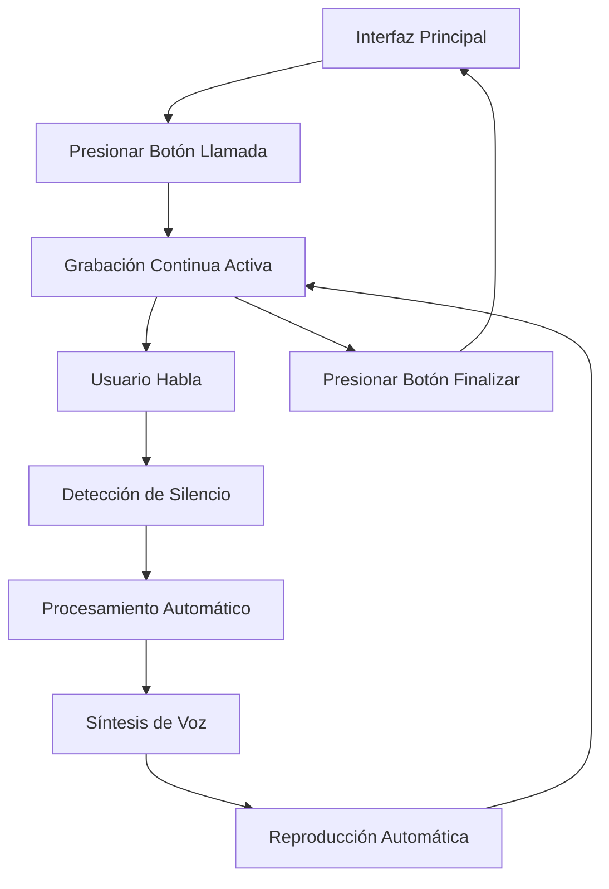

# Requisitos del Producto - IA Speaker

## 1. Descripción General del Producto

IA Speaker es una aplicación web React que simula una llamada telefónica con inteligencia artificial de manera completamente local. La aplicación integra el modelo de síntesis de voz sesame/csm-1b para generar respuestas habladas y LM Studio para la generación de texto, proporcionando una experiencia de conversación natural mediante un sistema de llamada con detección automática de voz.

- Soluciona la necesidad de interactuar con IA de forma natural mediante voz, simulando una llamada telefónica real.
- Dirigida a usuarios que buscan una experiencia de conversación fluida y privada con modelos de IA sin configuraciones complejas.
- Valor del mercado: Proporciona una alternativa local y privada a los asistentes de voz comerciales.

## 2. Funcionalidades Principales

### 2.1 Módulo de Funcionalidades

Nuestros requisitos de IA Speaker consisten en una página principal:

1. **Interfaz de Llamada**: botón de llamada, indicador de estado, procesamiento automático de voz con detección de silencio.

### 2.2 Detalles de Páginas

| Nombre de Página | Nombre del Módulo | Descripción de Funcionalidad |
|------------------|-------------------|------------------------------|
| Interfaz de Llamada | Botón de llamada | Iniciar y finalizar llamada con un solo botón, cambio visual de estado |
| Interfaz de Llamada | Grabación continua | Capturar audio del micrófono mientras la llamada está activa |
| Interfaz de Llamada | Detección de silencio | Detectar automáticamente cuando el usuario deja de hablar para procesar el audio |
| Interfaz de Llamada | Procesamiento automático | Enviar audio a LM Studio para transcripción y generación de respuesta sin intervención del usuario |
| Interfaz de Llamada | Síntesis de voz | Generar audio de respuesta usando sesame/csm-1b |
| Interfaz de Llamada | Reproducción automática | Reproducir respuesta de la IA automáticamente después de la síntesis |
| Interfaz de Llamada | Indicadores visuales | Mostrar estado de la llamada, grabación, procesamiento y reproducción |

## 3. Proceso Principal

El flujo principal del usuario simula una llamada telefónica:

1. **Inicio de llamada**: El usuario presiona el botón de llamada para iniciar la sesión.
2. **Grabación continua**: El sistema inicia la grabación automática del micrófono.
3. **Detección de silencio**: Cuando el usuario deja de hablar, el sistema detecta automáticamente el silencio.
4. **Procesamiento automático**: El audio se envía automáticamente a LM Studio para transcripción y generación de respuesta.
5. **Síntesis de voz**: El texto de respuesta se procesa con sesame/csm-1b para generar audio.
6. **Reproducción automática**: La respuesta se reproduce automáticamente al usuario.
7. **Continuación**: El ciclo se repite automáticamente hasta que el usuario finaliza la llamada.
8. **Fin de llamada**: El usuario presiona nuevamente el botón para terminar la sesión.

## 4. Diseño de Interfaz de Usuario

### 4.1 Estilo de Diseño

- **Colores primarios**: Azul oscuro (#1a365d) y azul claro (#3182ce)
- **Colores secundarios**: Gris claro (#f7fafc) y gris oscuro (#2d3748)
- **Estilo de botones**: Redondeados con sombras suaves, efectos hover
- **Fuente**: Inter, tamaños 14px para texto normal, 18px para títulos
- **Estilo de layout**: Diseño centrado con tarjetas, navegación lateral
- **Iconos**: Iconos de Lucide React para consistencia y claridad

### 4.2 Resumen de Diseño de Páginas

| Nombre de Página | Nombre del Módulo | Elementos de UI |
|------------------|-------------------|----------------|
| Interfaz de Llamada | Interfaz principal | Fondo degradado azul a púrpura, diseño centrado tipo teléfono |
| Interfaz de Llamada | Botón de llamada | Botón circular grande (#4CAF50 inactivo, #F44336 activo) con ícono de teléfono, animación de pulso durante llamada |
| Interfaz de Llamada | Indicadores de estado | Texto descriptivo del estado (Inactivo/En llamada/Procesando/Reproduciendo) |
| Interfaz de Llamada | Visualizador de audio | Ondas de audio en tiempo real durante grabación y reproducción |
| Interfaz de Llamada | Indicador de actividad | Spinner o animación durante procesamiento de IA |

### 4.3 Responsividad

La aplicación está diseñada con enfoque mobile-first simulando la interfaz de una aplicación de llamadas. Se optimiza para dispositivos táctiles con un botón principal de gran tamaño para fácil interacción. La interfaz se adapta a pantallas desde 320px hasta escritorio, manteniendo la simplicidad de una llamada telefónica en todos los dispositivos.