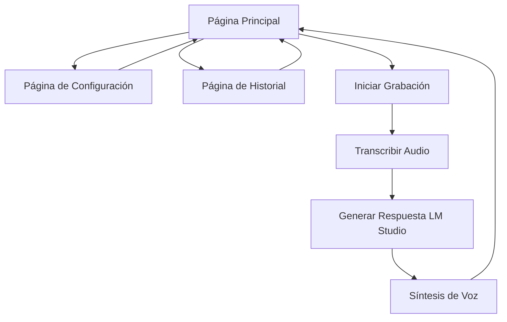

# IA Speaker - Documento de Requisitos del Producto

## 1. Descripción General del Producto
IA Speaker es una aplicación de escritorio que permite conversaciones por voz con inteligencia artificial de manera completamente local. La aplicación captura audio del usuario, lo transcribe a texto, genera respuestas usando LM Studio (API compatible con OpenAI), y convierte las respuestas a voz usando el modelo sesame/csm-1b.

El producto resuelve la necesidad de tener conversaciones naturales con IA sin depender de servicios en la nube, garantizando privacidad y funcionamiento offline.

## 2. Características Principales

### 2.1 Roles de Usuario
No se requieren roles diferenciados. La aplicación funciona con un usuario por defecto que tiene acceso completo a todas las funcionalidades.

### 2.2 Módulo de Características
Nuestra aplicación IA Speaker consta de las siguientes páginas principales:
1. **Página Principal**: interfaz de conversación, controles de audio, configuración básica.
2. **Página de Configuración**: configuración de LM Studio, configuración de modelo de voz, ajustes de audio.
3. **Página de Historial**: historial de conversaciones, búsqueda de conversaciones anteriores.

### 2.3 Detalles de Páginas

| Nombre de Página | Nombre del Módulo | Descripción de Características |
|------------------|-------------------|--------------------------------|
| Página Principal | Interfaz de Conversación | Mostrar conversación en tiempo real con burbujas de chat, indicador visual de estado (escuchando/procesando/hablando) |
| Página Principal | Controles de Audio | Botón de micrófono para iniciar/detener grabación, control de volumen de salida, indicador de nivel de audio |
| Página Principal | Respuesta de IA | Mostrar texto de respuesta generado, reproducir audio de respuesta usando sesame/csm-1b |
| Página de Configuración | Configuración LM Studio | Campo para URL del servidor LM Studio, selección de modelo, configuración de parámetros (temperatura, max tokens) |
| Página de Configuración | Configuración de Voz | Configuración del modelo sesame/csm-1b, ajustes de velocidad y tono de voz |
| Página de Configuración | Ajustes de Audio | Selección de dispositivo de entrada y salida, configuración de sensibilidad del micrófono |
| Página de Historial | Lista de Conversaciones | Mostrar conversaciones anteriores con fecha y hora, función de búsqueda por texto |
| Página de Historial | Detalles de Conversación | Ver conversación completa seleccionada, opción de reproducir audio de respuestas anteriores |

## 3. Proceso Principal
El flujo principal del usuario es el siguiente:
1. El usuario abre la aplicación y accede a la Página Principal
2. Configura LM Studio y el modelo de voz en la Página de Configuración si es la primera vez
3. Regresa a la Página Principal y presiona el botón del micrófono para iniciar una conversación
4. Habla al micrófono, la aplicación transcribe el audio a texto
5. El texto se envía a LM Studio para generar una respuesta
6. La respuesta se convierte a voz usando sesame/csm-1b y se reproduce
7. El usuario puede continuar la conversación o revisar el historial en la Página de Historial

## 4. Arquitectura Técnica
### 4.1 Stack Tecnológico
**Frontend:**
- React.js con TypeScript
- Web Audio API para captura de audio
- Fetch API para comunicación con servicios

**Backend:**
- Python con FastAPI para servir sesame/csm-1b
- Transformers de Hugging Face (versión 4.52.1+)
- PyTorch para inferencia del modelo

**Servicios Externos:**
- LM Studio (API compatible con OpenAI)
- Modelo sesame/csm-1b para síntesis de voz

### 4.2 Flujo de Datos
1. Frontend captura audio del micrófono
2. Conversión speech-to-text en el navegador
3. Envío de texto a LM Studio para generación de respuesta
4. Envío de respuesta a backend Python con sesame/csm-1b
5. Generación de audio y retorno al frontend

## 5. Diseño de Interfaz de Usuario
### 5.1 Estilo de Diseño
- **Colores primarios**: #2563eb (azul), #1f2937 (gris oscuro)
- **Colores secundarios**: #10b981 (verde), #ef4444 (rojo)
- **Estilo de botones**: Botones redondeados con efectos hover
- **Fuente**: Inter, tamaño base 16px
- **Estilo de layout**: Layout tipo card con navegación superior
- **Iconos**: Iconos estilo outline con animaciones suaves

### 5.2 Resumen de Diseño de Páginas

| Nombre de Página | Nombre del Módulo | Elementos de UI |
|------------------|-------------------|----------------|
| Página Principal | Panel de Control | Botón circular grande para iniciar/detener grabación (verde/rojo), indicador visual de nivel de audio, área de texto para mostrar conversación |
| Página Principal | Visualizador de Conversación | Lista scrolleable de mensajes con burbujas diferenciadas (usuario: azul claro, IA: gris claro), timestamps, indicadores de estado |
| Página Principal | Controles de Audio | Botones para silenciar micrófono, ajustar volumen, selector de dispositivos de audio |
| Configuración | Panel de Configuración | Formulario con campos para URL de LM Studio, configuración de modelo de voz, ajustes de calidad de audio |

### 5.3 Responsividad
Diseño mobile-first con adaptación a desktop, optimizado para interacción táctil en dispositivos móviles.